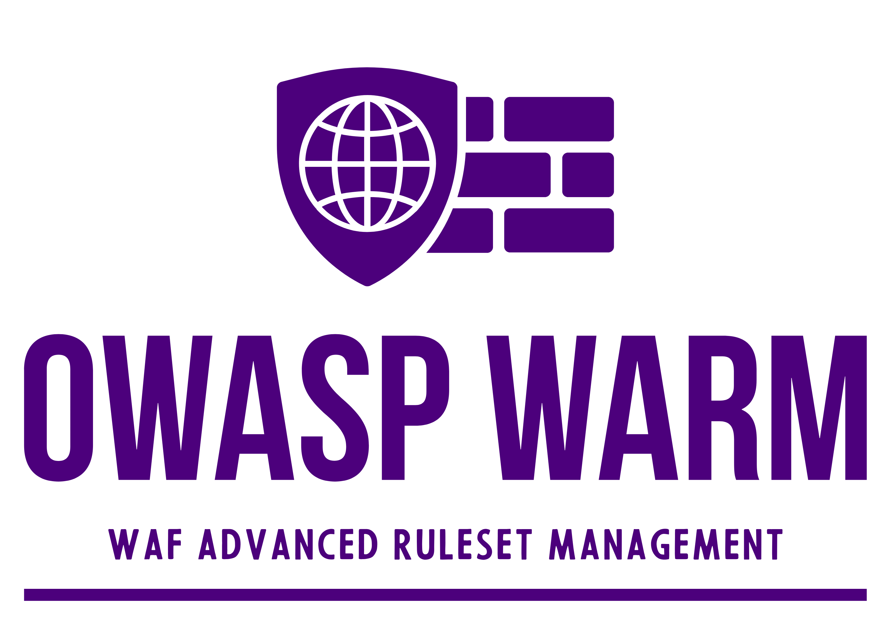
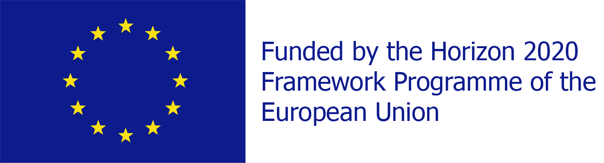

---

layout: col-sidebar
title: OWASP WAF Advanced Ruleset Management
tags: example-tag
level: 2
type: code
pitch: A very brief, one-line description of your project

---
# OWASP WARM – WAF Advanced Ruleset Management

⸻

**OWASP WARM** tackles a critical challenge: improving the effectiveness of the rulesets used by Web Application Firewalls (WAFs) to protect web applications and APIs from attacks.

WAF rulesets—typically made up of regular expressions—are applied generically, without taking into account how the protected application is built or what types of input it expects. Furthermore, each rule is often assigned a score that reflects the severity of the attack it detects. This score is usually based on the experience of the ruleset author and not on the specific context of the application in which the ruleset is deployed.

Before going live, a tuning phase is necessary to reduce false positives by:
- disabling overly sensitive rules,
- adjusting detection thresholds,
- reweighting rule scores.

This process is mostly manual, time-consuming, and error-prone. While it reduces false positives, it can also severely undermine detection capabilities—resulting in a suboptimal tradeoff between accuracy and security.

*The Solution: Machine Learning for Smarter Tuning*

**OWASP WARM** introduces an innovative, machine learning–driven approach to automate and improve this tuning process. By training a simple linear model on real-world data, the system can:
- systematically explore all rule combinations,
- adjust rule scores based on actual traffic and attack patterns,
- identify an optimal balance between false positives and detection accuracy.

The project will focus on applying this method in real deployment environments, starting with the widely adopted OWASP Core Rule Set (CRS). The techniques developed will be generalizable and can be adapted to other rulesets as well.

⸻

### Roadmap

Within the first 12 months, the project aims to deliver:

- Documentation explaining the problem and proposed approach  
- Public datasets to reproduce experiments from the referenced study *“ModSec-Learn: Boosting ModSecurity with Machine Learning”*  
- A first dataset of legitimate traffic  
- A dataset of malicious traffic focused on SQL injection (SQLi) attacks  
- Code and scripts to run the optimization process and update the scores of SQLi rules in production CRS-based environments  

In the long term, the project will expand to include:

- Support for other attack categories (beyond SQLi)  
- Production-ready tools to apply optimization on live traffic and deploy the resulting ruleset easily  
- Performance evaluations on benchmark environments using the provided datasets  
- Continuously updated documentation to track project progress

**OWASP WARM** empowers security teams to replace trial-and-error tuning with data-driven optimization, turning WAF rule management into a continuous and intelligent security enhancement process.

**_Acknowledgments_**

**OWASP WARM** is supported by the APPtake project ([www.apptake.eu](https://www.apptake.eu)). APPtake is funded under Grant Agreement No. ​101128082​ by the European Cybersecurity Competence Centre.

  
  

**OWASP WARM** is supported by the KINAITICS project ([http://kinaitics.eu](http://kinaitics.eu)). KINAITICS has received funding from Horizon Europe under Grant Agreement No. 101070176.

  
  

